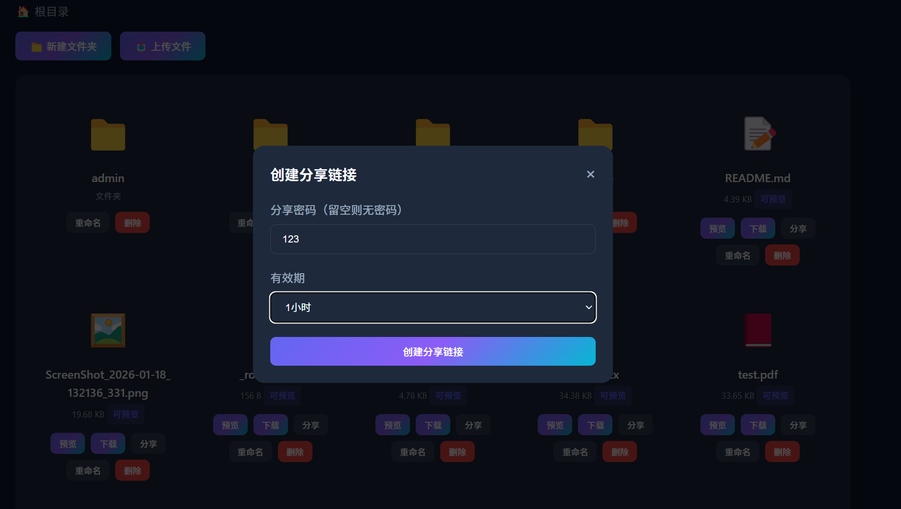
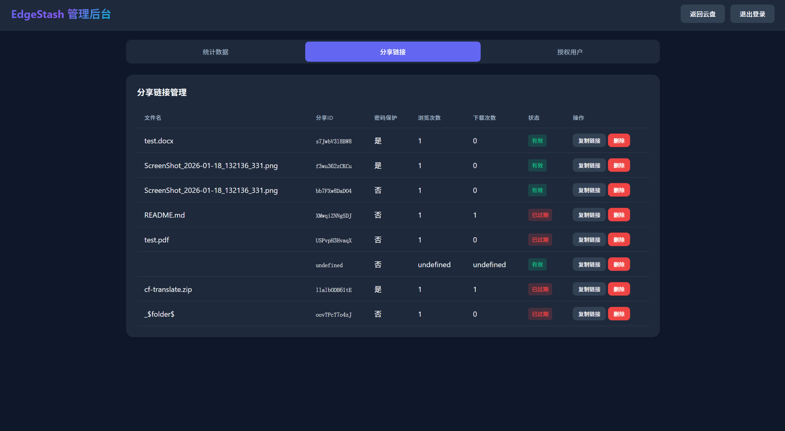

# EdgeStash | 一款全新的Cloudflare R2云盘，支持带密码分享、查看下载量、管理用户等功能

<!--   -->

**EdgeStash** 是一个功能强大、易于部署的私有云盘解决方案，完全构建在 Cloudflare 的全球网络之上。它利用 **Cloudflare Workers**、**R2 存储** 和 **KV 存储**，为您提供一个安全、快速且低成本的个人或团队文件存储与分享平台。

EdgeStash**支持带密码分享文件、在线预览docx或pdf文档、后台管理授权用户、查看分享文件浏览/下载量！**

这个项目旨在提供一个“一键部署”的体验，您只需要一个 Cloudflare 账户，即可在几分钟内拥有属于自己团队的云盘服务。

## 🛸 预览

<!-- - 🌍 官网：[xxx.com未完成](https:// /)
- 😃 部署视频教程：未制作完成 -->

|                                    |                                    |
| ---------------------------------- | ---------------------------------- |
|  |  |
|  |  |

## ✨ 核心特性

- **👑多用户系统**：
  - **管理员**：拥有最高权限，可通过密码登录，管理用户、分享链接和查看统计数据。
  - **授权用户**：由管理员授权创建（邮箱+密码），授权用户仅可浏览文件首页，无法进入管理后台。
  - **普通用户**：使用密码下载被分享文件，无密码保护的分享文件可直接下载。

- **⏳灵活的文件分享**：
  - **密码保护**：为分享链接设置访问密码。
  - **有效期设置**：支持 1 小时、1 天、1 个月或永久有效。
  - **访问统计**：跟踪每个分享链接的浏览和下载次数。

- **🧸在线文件预览**：
  - 无需下载，直接在浏览器中预览多种文件格式。
  - **文档**：Word (.docx), PDF, Markdown (.md), 纯文本 (.txt)。
  - **图片**：JPG, PNG, GIF, WebP, SVG 等。
  - **代码/数据**：JSON 文件自动格式化。
  - **音视频**：MP4, WebM, MP3, WAV 等。

- **📁强大的文件管理**：
  - 支持文件和文件夹的创建、重命名、移动和删除。
  - 拖拽式文件上传和多文件上传。
  - 面包屑导航，轻松在不同层级目录间穿梭。

- **🔧管理后台**：
  - **数据统计**：实时查看总分享数、总浏览量和总下载量。
  - **用户管理**：轻松添加新用户、撤销现有用户授权。
  - **分享管理**：集中查看和删除所有已创建的分享链接。

- **💡现代化界面**：
  - 紫蓝色系渐变配色，美观、专业。
  - 完全响应式设计，适配桌面、平板和手机。
  - 流畅的动画和操作反馈提示。

- **🙈安全与隐私**：
  - 所有数据存储在您自己的 R2 和 KV 中，完全掌控。
  - 通过 JWT (JSON Web Tokens) 进行安全的会话管理。

## 🚀 部署指南

部署 EdgeStash 非常简单，全程在 Cloudflare Dashboard 中完成。

### 前置要求

- 一个 Cloudflare 账户。
- 已开通 R2 和 Workers 、 KV 服务。

### 部署步骤

| 配置   | 变量名          | 说明              |
| :----- | :----------------------------- | :------------------------- |
| `R2` | `R2_BUCKET` | 存放文件的地方，名称随意|
| `KV` | `KV_STORE`| 存放链接的地方，名称随意|
| `管理员密码` | `ADMIN_PASSWORD`| 你想设置什么都行  |

1.  **创建 R2 存储桶**
    - 登录 Cloudflare -> R2 -> 创建存储桶。
    - 记下您的存储桶名称（例如 `edgestash-files`）。

2.  **创建 KV 命名空间**
    - 登录 Cloudflare -> Workers 和 Pages -> KV -> 创建命名空间。
    - 记下您的命名空间名称（例如 `edgestash-kv`）。

3.  **创建 Worker**
    - 登录 Cloudflare -> Workers 和 Pages -> 创建应用程序 -> 创建 Worker。
    - 为您的 Worker 命名（例如 `edgestash`），然后点击 **部署**。

4.  **上传代码**
    - 在 Worker 页面，点击 **编辑代码**。
    - 将本项目提供的 `worker.js` 文件内容完整粘贴进去。
    - 点击 **部署**。

5.  **配置绑定**
    - 返回 Worker 概览页面，点击 **设置** -> **变量和机密**。
    - **配置环境变量**：
        - `ADMIN_PASSWORD`：设置您的管理员登录密码。
    - **配置 R2 绑定**：
        - 变量名称：`R2_BUCKET`
        - R2 存储桶：选择您在第 1 步创建的存储桶。
    - **配置 KV 绑定**：
        - 变量名称：`KV_STORE`
        - KV 命名空间：选择您在第 2 步创建的命名空间。

6.  **完成！**
    - 访问您的 Worker URL (`https://<worker-name>.<subdomain>.workers.dev`) 即可开始使用！
7.  **绑定你自己的域名！**

### 😤已知的小bug
管理员登录时如果点击`登录`按钮无反应，切换到`用户登录`，把`用户登录`的`邮箱`**输入框内容清空**，然后重新进行管理员登录即可~

## 📚 API 接口参考

EdgeStash 通过一套 RESTful API 提供服务，以下是核心接口列表。

| 方法   | 路径                           | 说明                       |
| :----- | :----------------------------- | :------------------------- |
| **认证** |                              |                            |
| `POST` | `/api/login`                   | 管理员或用户登录           |
| `POST` | `/api/logout`                  | 退出登录                   |
| `GET`  | `/api/auth/check`              | 检查当前登录状态           |
| **文件管理** |                            |                            |
| `GET`  | `/api/files/*`                 | 获取指定路径下的文件和文件夹 |
| `POST` | `/api/files/*`                 | 上传文件到指定路径         |
| `PUT`  | `/api/files/*`                 | 重命名文件或文件夹         |
| `DELETE`| `/api/files/*`                 | 删除文件或文件夹           |
| `POST` | `/api/folders`                 | 创建新文件夹               |
| `GET`  | `/api/download/*`              | 下载文件                   |
| `GET`  | `/api/preview/*`               | 获取文件内容用于在线预览   |
| **分享管理** |                            |                            |
| `POST` | `/api/share`                   | 为文件创建分享链接         |
| `GET`  | `/api/share/:id`               | 获取分享链接信息           |
| `POST` | `/api/share/:id/download`      | 下载分享的文件             |
| **管理后台** |                            |                            |
| `GET`  | `/api/admin/stats`             | 获取统计数据               |
| `GET`  | `/api/admin/shares`            | 列出所有分享链接           |
| `DELETE`| `/api/admin/shares/:id`        | 删除指定的分享链接         |
| `GET`  | `/api/admin/users`             | 列出所有授权用户           |
| `POST` | `/api/admin/users`             | 创建新用户                 |
| `DELETE`| `/api/admin/users/:email`      | 删除指定用户               |

## 📜 开源协议

本项目采用 **MIT License** 开源。

您可以自由地使用、修改、分发本项目的代码，但需要在您的衍生作品中包含原始的版权和许可声明。

---

